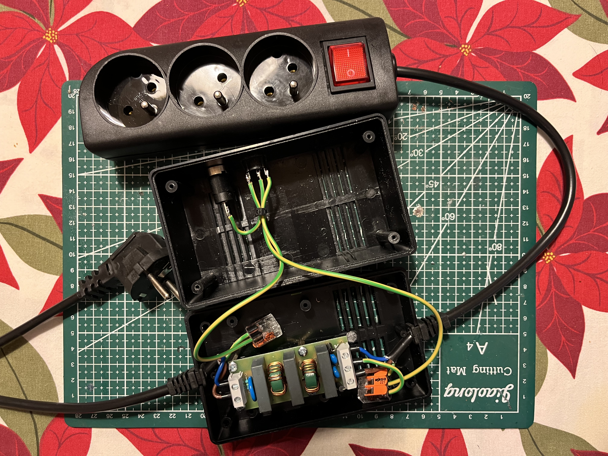
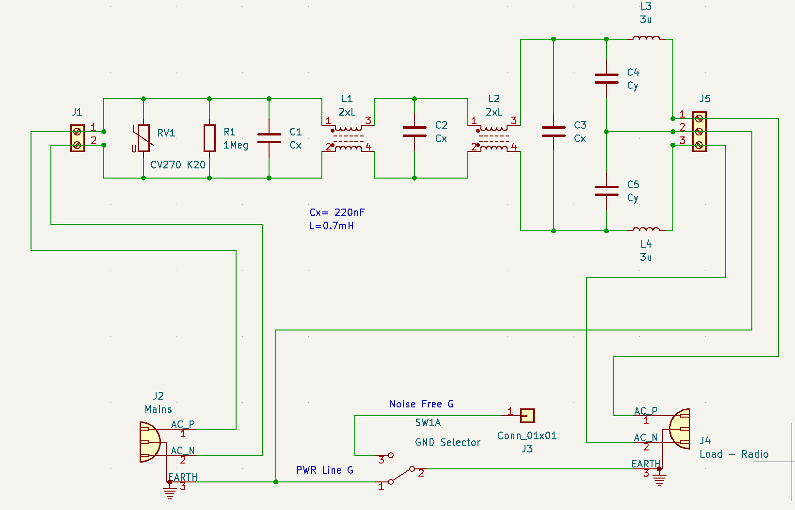
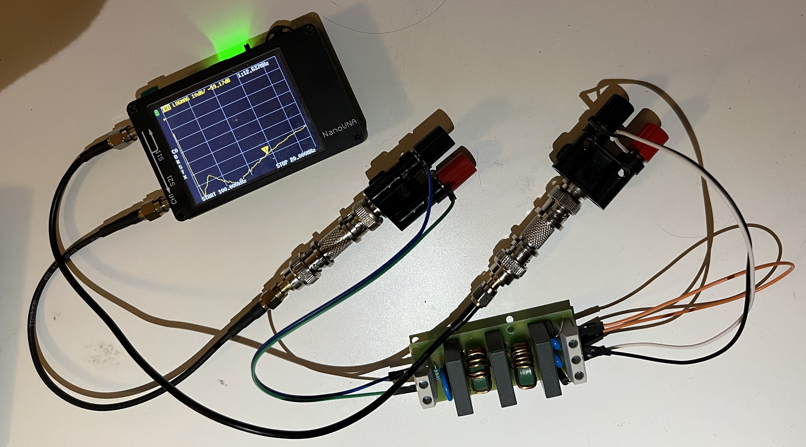
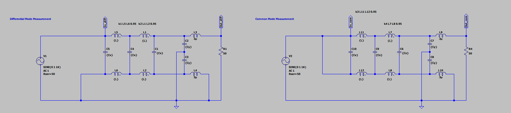
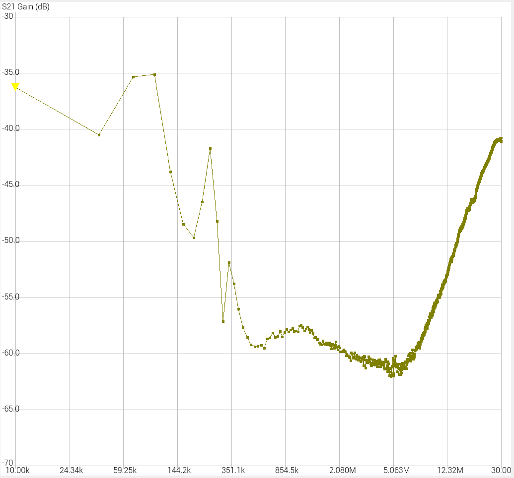
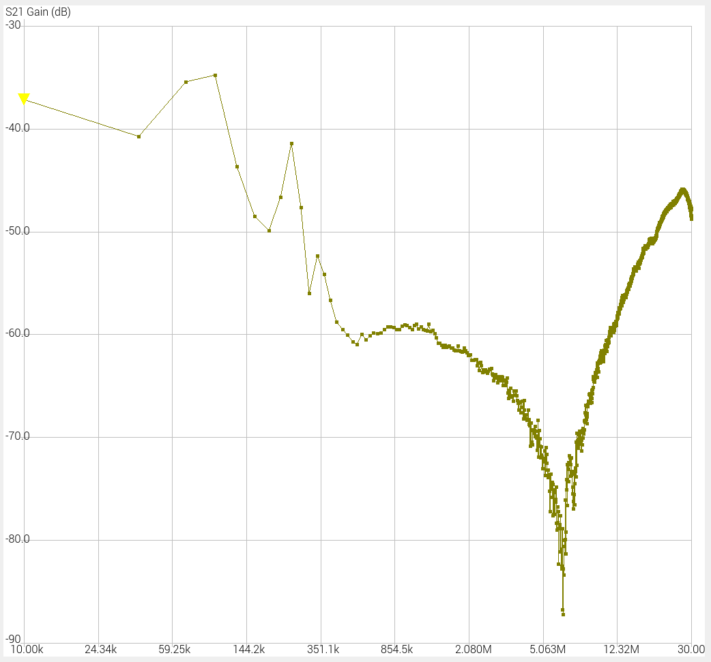
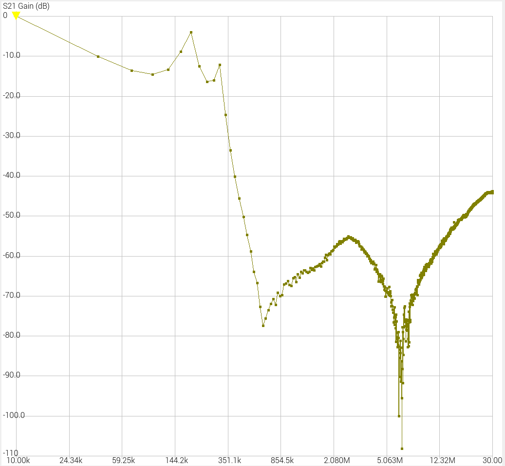
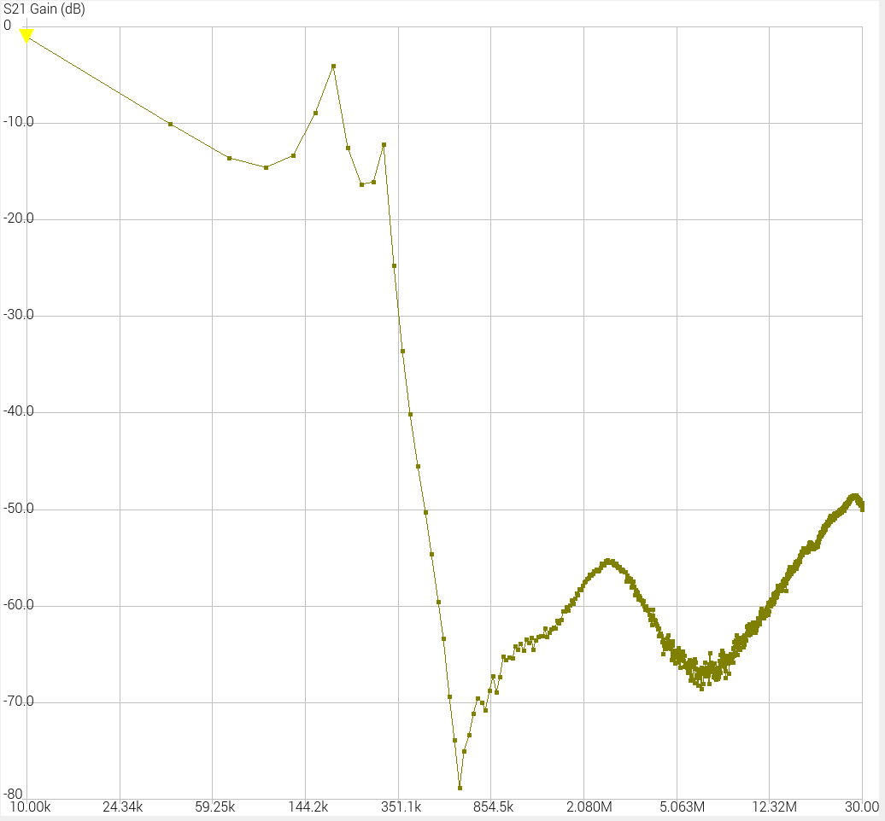
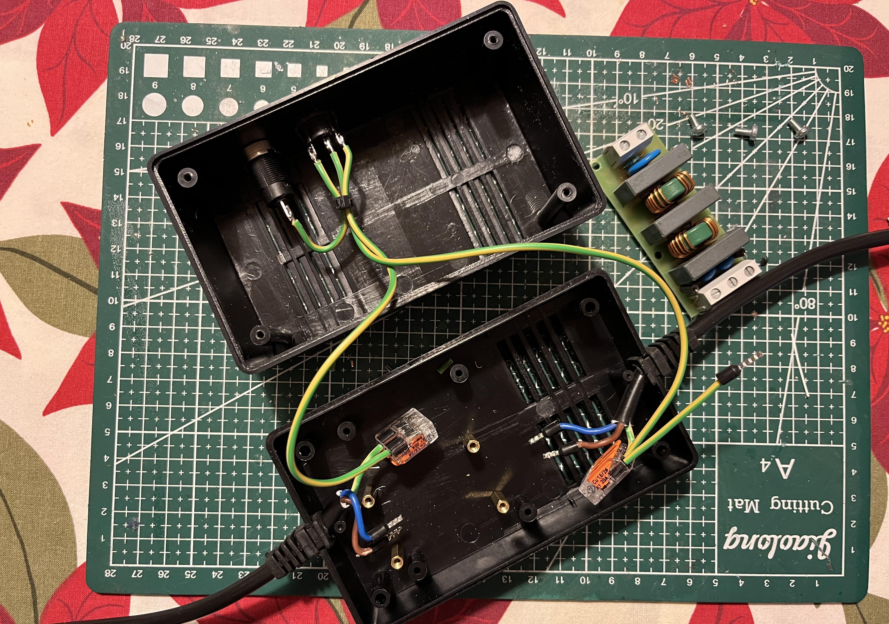
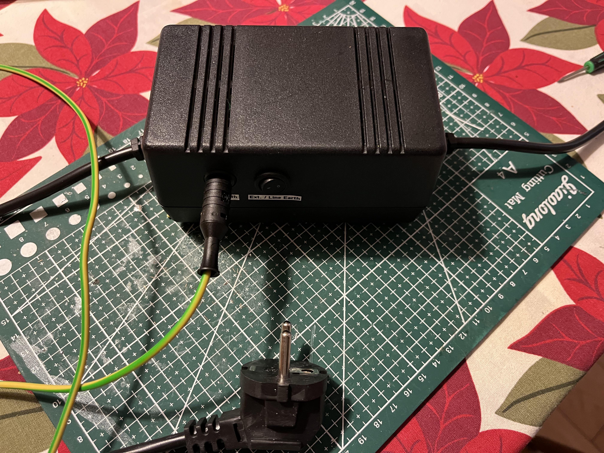

# EMI Filter Analysis 

## Introduction

I have started this project as part of efforts to reduce noise floor observed on VLF bands when experimenting with my miniwhip antenna [2].
I have to admit that results are mixed. I do not see major improvements from using EMC Filter on VLF band, but I can definitely appreciate/hear the  benefit of using noise free ground when using my cristal radio. It shall be noted that presented device is based on commercially available EMC filter made by polish company Filtercon (model: FB1M 5A/250V) [3]. Design has been enhanced by adding the option to replace power line ground with "noise free ground" in line with proposal made by Nico PA0NHC [1].

THIS PROJECT INVOLVES MODIFICATIONS TO THE GROUNDING AND RECONNECTION OF 220V POWERLINE CABLING. WORKING WITH HIGH-VOLTAGE ELECTRICAL SYSTEMS CAN BE HAZARDOUS AND REQUIRES EXPERTISE. ENSURE YOU HAVE THE NECESSARY KNOWLEDGE AND EXPERIENCE BEFORE PROCEEDING. ANY ACTIONS YOU TAKE ARE AT YOUR OWN RISK. THE AUTHOR ASSUMES NO RESPONSIBILITY FOR DAMAGES, INJURIES, OR CONSEQUENCES RESULTING FROM THE USE OF THIS INFORMATION. ALWAYS PRIORITIZE SAFETY AND CONSULT A QUALIFIED PROFESSIONAL IF IN DOUBT.

A noise-free ground must comply with all applicable safety regulations. Specifically, its resistance must not exceed the limits imposed by local standards. For example, in Poland, the resistance should be less than 7 ohms.

The main lessons learneded from this project are:

1) Before installing an EMC filter in your setup, try powering your radio from a battery (disconnect it also from PC and other equipment). Compare the interference levels when the radio is battery-powered versus when it is connected to the AC powerline. If the interference levels remain unchanged, it is likely that the noise originates from another source.

2) Installing the EMC filter in the reversed configuration suggested in [1] did not improve interference suppression in my case, as shown in the measurements below. Consequently, the final design uses the filter as recommended by the manufacturer (see the schematic below).

## Device Schematics

## Measurement results

### Measurement rig:

### Measurement setup:

   
### Measurement results:

Differential Mode:Power Line connected to filter input (as suggested by manufacturer):  

Differential Mode:Power Line connected to filter output (reversed configuration):   

Common Mode:Power Line connected to filter input (as suggested by manufacturer):  

Common Mode:Power Line connected to filter output (reversed configuration): 

## EMC Filter design

It is important to note that the voltage at the junction of capacitors Cy (when not connected to Earth) is half of the power line voltage. This occurs because C4 and C5 form a voltage divider. As a result, you will measure approximately 219V RMS at this point, which is sufficient to activate a neon test probe. The capacitor values are chosen to ensure that the current flowing through your body when touching this point remains within safe limits (see calculations below). However, to eliminate any risk of exposure to potentially lethal voltages (e.g., if C4 malfunctions and the C4/C5 junction is not grounded), I used a safe, noise-free Earth connection.

Power line voltage:

$Up=310V$

$Upp=2*Up=620V$

$Urms=\frac{Upp}{2*\sqrt{2}} = 620/2.828 = 219.23V$

Impedance of Cy at 50Hz frequency for Cy=2.2nF:

$Xcy = \frac{1}{2*PI*f*C} = 1.45Mohm$

Assuming the CY/CY junction is touched with a wet hand (with the body resistance in such a case estimated to be around 30 ohms - more realistic value would be 1kohm), the current flowing through the body can be calculated as follows, under the assumption that Rbody≪Xcy:

$Irms = \frac{Urms}{Xcy}= \frac{219}{1.45*10^6} = 0.15mA$

Maximum allowed values of capacitors Cy is defined in IEC 60384-14 and in case of consumer electronics can range between: 1-4.7nF.

A current below 1 mA is generally barely perceptible, while currents exceeding 10 mA can be potentially lethal!

## References

[1] How to get any Miniwhip optimally working. Yes, it costs effort ! - YouTube video - Nico Veth, PA0NHC

[2] Miniwhip project, https://github.com/SP5GW/MiniWhip_Antenna - Andrzej Mazur, SP5GW

[3] Filtercon EMC Filter application note, https://filtercon.com.pl/sieciowe-filtry-przeciwzakloceniowe-serii-fb1s-i-fb1m-z-elementem-przeciwprzepieciowym/
